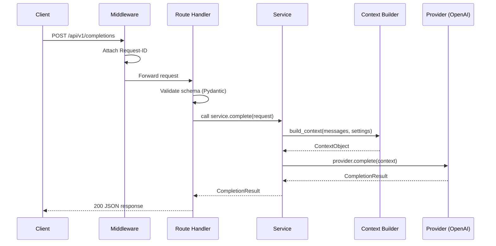
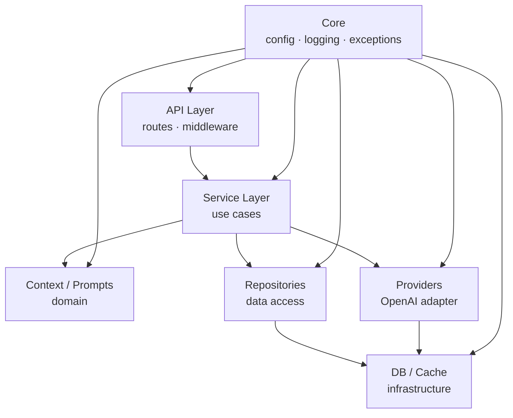
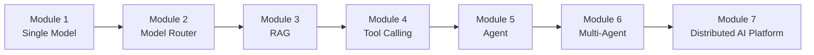

# Architecture

## Overview

foundation-ai is a production-grade, single-model LLM backend built with FastAPI.
It is designed as an educational reference implementation that teaches how AI backend
systems are built from first principles before introducing frameworks.

---

## Layered Architecture

The application is organised into strict horizontal layers.  Dependencies flow
**downward only** — upper layers call lower layers; lower layers never import
from upper layers.

```
┌──────────────────────────────────────────────────────┐
│                    HTTP Clients                       │
└──────────────────────┬───────────────────────────────┘
                       │ HTTP
┌──────────────────────▼───────────────────────────────┐
│              API Layer  (app/api/)                    │
│  Routes · Middleware · Dependencies · Schemas         │
└──────────────────────┬───────────────────────────────┘
                       │ function calls
┌──────────────────────▼───────────────────────────────┐
│           Service Layer  (app/services/)              │
│  Use-case orchestration · Business rules              │
└──────────┬───────────────────────────┬───────────────┘
           │                           │
┌──────────▼──────────┐   ┌────────────▼──────────────┐
│  Context  (app/context/) │ Providers (app/providers/) │
│  Prompts  (app/prompts/) │ Repositories (app/repos/)  │
└──────────────────────┘   └───────────────────────────┘
                       │
┌──────────────────────▼───────────────────────────────┐
│           Infrastructure Layer                        │
│  Database (app/db/) · Cache (app/cache/)              │
│  Observability (app/observability/)                   │
└──────────────────────────────────────────────────────┘
```

### Dependency direction rule

> A module may only import from the same layer or a **lower** layer.
> It must never import from a layer above it.

This rule keeps each layer independently testable and prevents circular
dependencies.

---

## Package Responsibilities

| Package | Layer | Responsibility |
|---|---|---|
| `app/api/` | API | HTTP routing, middleware, DI wiring |
| `app/api/routes/` | API | Route handler functions |
| `app/api/middleware/` | API | Cross-cutting HTTP concerns |
| `app/core/` | Cross-cutting | Config, logging, exceptions, lifecycle |
| `app/services/` | Service | Use-case orchestration |
| `app/providers/` | Provider | AI vendor SDK adapters |
| `app/context/` | Domain | Context assembly for the LLM |
| `app/prompts/` | Domain | Prompt template registry |
| `app/repositories/` | Data Access | Persistence abstractions |
| `app/models/` | Domain | Core domain entities |
| `app/schemas/` | API | Pydantic request/response models |
| `app/cache/` | Infrastructure | Cache abstraction |
| `app/observability/` | Infrastructure | Metrics, tracing |
| `app/db/` | Infrastructure | Database engine, sessions |
| `app/utils/` | Cross-cutting | Stateless utility functions |

---

## Request Lifecycle



---

## Dependency Direction (Mermaid)



---

## Design Patterns in Use

| Pattern | Location | Why |
|---|---|---|
| **Dependency Injection** | `app/api/dependencies.py` | Decouples routes from concrete implementations; enables test overrides |
| **Strategy** | `app/providers/` | Swap AI providers without changing service layer |
| **Builder** | `app/context/` | Assemble context incrementally with validation at each step |
| **Repository** | `app/repositories/` | Isolate persistence technology from business logic |
| **Factory** | `app/providers/` (future) | Instantiate the correct provider from configuration |
| **Facade** | `app/services/` | Present a simple interface over complex multi-step workflows |
| **Decorator** | `app/observability/` (future) | Wrap provider calls with metrics/tracing transparently |

---

## Future Architecture Evolution



Each module is additive.  The layered architecture means new capabilities
slot in at the correct layer without restructuring existing code.
